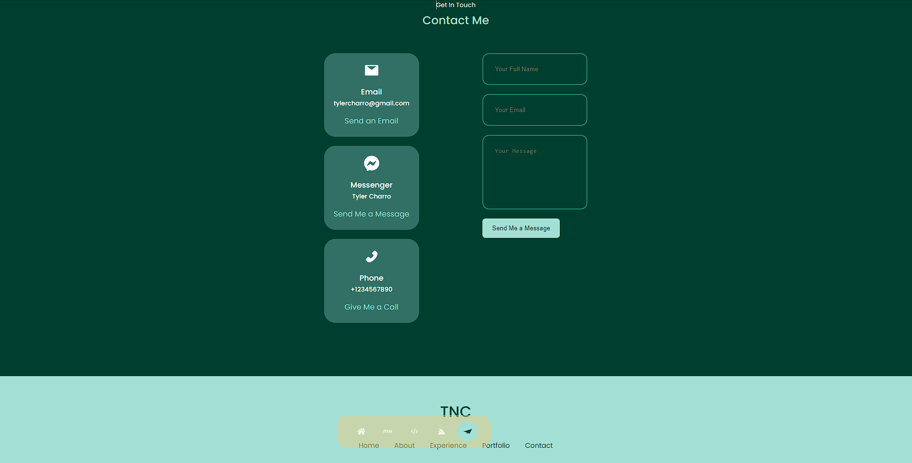

# React-to-This
  # Description
  My up to date portfolio using react
  # Table of contents
- [React-to-This](#react-to-this)
- [Description](#description)
- [Table of contents](#table-of-contents)
- [Installation](#installation)
- [Usage](#usage)
- [License](#license)
- [Contributors](#contributors)
- [Tests](#tests)
- [Questions](#questions)
 # Installation
  The following necessary dependecies must be installed to run the aplication: @testing-library/jest-dom, @testing-library/react, @testing-library/user-event, react, react-dom, react-icons, react-scripts, web-vitals
  
  # Usage
  An app to that has a user friendly up to date portfolio of myself

  # License
  This project is licensed under the None license.
  
  # Contributors
  Contributors: youtube.com, google.com, and UTA documentation
  # Tests
  The folloing is needed to run the test: n/a
  # Questions
  If you have any questions about the repo, contact tylercharro@gmail.com

  #To run 
  do an npm install, then an npm run start

  Github Repo Link:
  https://github.com/NathanTyle/React-to-This

  Gihub Pages Link:
  https://nathantyle.github.io/React-to-This/

  Heroku Link:
  https://reacttothis.herokuapp.com/

